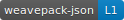
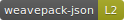
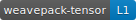
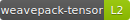

# weavepack Conformance Badges

Static SVG badges for weavepack conformance claims.  These live here until a
live badge endpoint exists (planned once ≥ 2 certified independent
implementations exist — see governance/04-conformance-certification.md).

## Available badges

| Badge | File | Meaning |
|---|---|---|
|  | `badges/json/L1.svg` | weavepack-json, Level 1 (decoder only) |
|  | `badges/json/L2.svg` | weavepack-json, Level 2 (encoder round-trip) |
|  | `badges/json/L3.svg` | weavepack-json, Level 3 (byte-exact) |
|  | `badges/tensor/L1.svg` | weavepack-tensor, Level 1 (decoder only) |
|  | `badges/tensor/L2.svg` | weavepack-tensor, Level 2 (round-trip) |
|  | `badges/tensor/L3.svg` | weavepack-tensor, Level 3 (byte-exact) |

## Conformance levels

| Level | Colour | Guarantee |
|---|---|---|
| L1 (Decoder) | blue | Correctly decodes any payload the reference encoder produces |
| L2 (Encoder) | yellow-green | Round-trip: encode → reference-decode → original value |
| L3 (Reference) | green | Byte-exact match against the JS reference for all corpus vectors |

## Usage in a README

Copy the Markdown snippet for the level(s) your implementation claims.
Replace the raw GitHub URL with the correct path to this repo + branch.

```markdown
[](https://github.com/weavedb/arjson/blob/weavepack/weavepack/governance/04-conformance-certification.md)

[](https://github.com/weavedb/arjson/blob/weavepack/weavepack/governance/04-conformance-certification.md)

[](https://github.com/weavedb/arjson/blob/weavepack/weavepack/governance/04-conformance-certification.md)
```

The badge is decorative; it carries no more weight than the README conformance
claim it links to.  See governance/04-conformance-certification.md for the full
conformance claim format.

## Adding a new badge

When a new profile or level is needed:

1. Copy an existing SVG as a template.
2. Update `aria-label`, `<title>`, label text, textLength, and colour.
3. Colour guide: L1 → `#007ec6`, L2 → `#97ca00`, L3 → `#44cc11`.
4. Add the new row to the table above.
5. Update governance/04-conformance-certification.md to reference the path.

## Migration to a live endpoint

Once a live HTTPS endpoint exists at `weavepack.dev` (or equivalent):

1. The SVG files here become canonical fallback copies.
2. Update governance/04-conformance-certification.md to show the live URL as
   primary and the raw GitHub URL as fallback.
3. The static files remain; the endpoint serves the same content.
